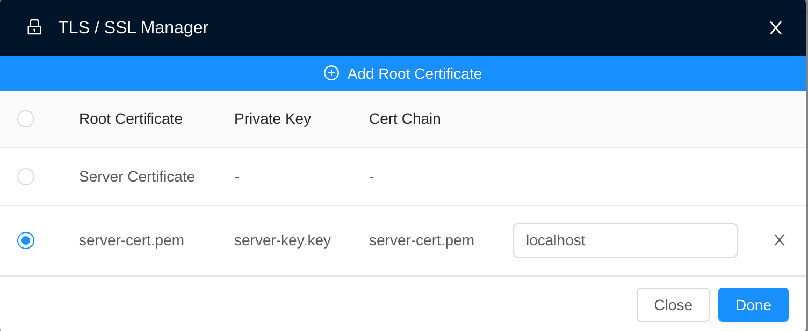

# Mask 😷

This project is a playground to learn gRPC. This repo contain 2 microservices which is used by the [graphie repo](https://github.com/shigedangao/graphie) to expose French's covid data.

# Data uses

Data comes from the website [data.gouv.fr](https://data.gouv.fr/). I also used data from the [etalab repository](https://github.com/etalab/data-covid19-dashboard-widgets). Below is the current dataset which is exposed by these gRPC microservices:

## Hospital microservices

- [Hospital cases by age by region (donnees-hospitalieres-classe-age-covid19-<date>)](https://www.data.gouv.fr/fr/datasets/r/08c18e08-6780-452d-9b8c-ae244ad529b3)
- [Hospital new case (donnees-hospitalieres-nouveaux-covid19-<date>)](https://www.data.gouv.fr/fr/datasets/r/6fadff46-9efd-4c53-942a-54aca783c30c)
- [Mix betweeen SI-VIC, SI-DEP & VAC-SI ⚠️ this dataset is not regularly updated...](https://raw.githubusercontent.com/etalab/data-covid19-dashboard-widgets/master/files_new/vacsi_non_vacsi_nat.csv)
- [Entry in ICU for unvax people / 1M](https://raw.githubusercontent.com/etalab/data-covid19-dashboard-widgets/master/dist/sc_non_vacsi.json)
- [Entry in ICU for vax people / 1M](https://raw.githubusercontent.com/etalab/data-covid19-dashboard-widgets/master/dist/sc_vacsi.json)

## PCR microservices

- [Positive pcr test by department (sp-pos-quot-dep-<date>)](https://www.data.gouv.fr/fr/datasets/r/406c6a23-e283-4300-9484-54e78c8ae675)
- [Positive pcr test by region (sp-pos-quot-reg-<date>)](https://www.data.gouv.fr/fr/datasets/r/001aca18-df6a-45c8-89e6-f82d689e6c01)
- [Positivity cases per department for 100k daily](https://www.data.gouv.fr/fr/datasets/r/4180a181-a648-402b-92e4-f7574647afa6)

# Contributing

## Getting started

### Docker

A docker-compose.yaml can be founded. You can use tool such as docker / podman to bootstrap the project.

### Manual installation

In the manual installation. You are required to have:

- Postgres
- Rust
- Python3

1. You may create a file named `config.toml` from the `config.toml.dist` file. Fill the `config.toml` with your local postgres installation. 
2. Import the data by running the command `python3 ./import.py`
3. Check the TLS certificate section and then generate a set of TLS certificate with the command `./generator.sh`. The script will ask you to prompt password to generate these certificates
4. You should be done. Go to one of the microservice folder either hospital or pcr and you may run the command ```cargo run```

# Misc info

## Healthcheck

These project run in a Kubernetes cluster. As a result we need to configure a healthcheck for the pods. To do that we uses [grpc-health-probe](https://github.com/grpc-ecosystem/grpc-health-probe). Below is a command which shows how we do the healthcheck. :warning: the gRPC healthcheck is currently in alpha stage. We may switch to the native gRPC healthcheck when available in beta or in ga.

```bash
./grpc_health_probe -addr=127.0.0.1:9000 -service=Hospital \
    -tls \
    -tls-ca-cert mask/keys/ca-cert.pem \
    -tls-server-name=localhost
```

## TLS certificate

These microservices uses self-signed certificate. These certificate & key can be generate by using the `generator.sh` bash script. Before running. You must change the subject in the `generator.sh`. The microservices will uses the `server-cert.pem` & `server-key.key`. Below is an example

```diff
- openssl req -x509 -newkey rsa:4096 -days 365 -keyout keys/ca-key.pem -out keys/ca-cert.pem -subj "[replace]"
+ openssl req -x509 -newkey rsa:4096 -days 365 -keyout keys/ca-key.pem -out keys/ca-cert.pem -subj "/C=FR/ST=Ile-de-france/L=Paris/O=foo/OU=bar/CN=toto/emailAddress=foo@gmail.com"

- openssl req -newkey rsa:4096 -keyout keys/server-key.pem -out keys/server-req.pem -subj "[replace]"
+ openssl req -newkey rsa:4096 -keyout keys/server-key.pem -out keys/server-req.pem -subj "/C=FR/ST=Ile-de-france/L=Paris/O=foo/OU=bar/CN=tata/emailAddress=foo@gmail.com"
```

## Test gRPC server with bloom rpc

To test the gRPC server. It's recommended to use [bloom rpc](https://github.com/bloomrpc/bloomrpc). Because we're running in secure mode. You may refer to the configuration below for the TLS configuration of bloomrpc

<p align="center">
  
</p>

## Using grpcurl

Should you want to use [grpcurl](https://github.com/fullstorydev/grpcurl). You may refer to the example below:

```bash
./grpcurl -cacert <path to ca cert>/ca-cert.pem \
    -d '{"day": 19, "month": 10, "year": 2021}' \
    <endpoint>:9000 icu.IcuService/getFranceIcuLevelForNonVaxx
```

## Unit test

Each services have unit tests. These tests doesn't really test the gRPC server. But it more or less test the async function inside such as database query, simulate rpc input & output
